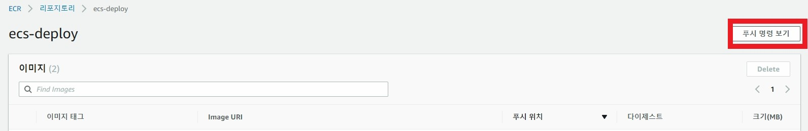
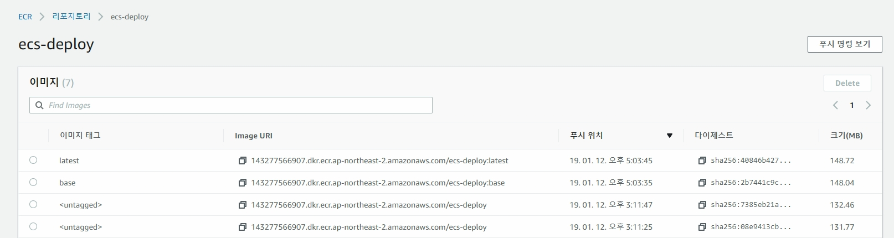

# ECS, ECR, Travis CI를 이용하여 CI/CD 배포 환경 만들기


## 환경 소개

ECR에 Docker Image를 올린 후, ECS에서 올린 이미지를 가지고 서비스를 실행한다.

Travis CI를 이용하여 `master` 브랜치에 PUSH가 발생하면 자동으로 테스트, 마이그레이션, 배포가 이루어진다.

또한 서비스의 중단 없이 지속적인 배포를 위해 `BlueGreenDeployment`를 실행한다.


Nginx + Gunicorn + Django 를 사용하여 배포해볼것이고 배포시 Test실행, Migrate를 수행하게 할것이다.


## 기본 환경 세팅

```bash
$ mkdir ecs-deploy
$ git init
# .gitignore 맘껏 생성 [반드시 ".secrets/" 는 gitignore에 포함하여야한다!]

# 가상환경 세팅, PIPENV를 사용하였다
$ pipenv --python 3.6.6
$ pipenv shell
$ pipenv install django

# 필요한 폴더들을 생성
$ mkdir .bin  # 명령 스크립트들을 담은 폴더
$ mkdir .config  # nginx, supervisord, gunicorn 설정이 들어있을 폴더
$ mkdir .secrets  # 프로젝트에 포함되면 안되는 중요한 정보들을 담음

# 작성자의 레포지토리의 before_deploy 브랜치를 클론하여 사용한다.
```


### 프로젝트 설정

[레포지토리](https://github.com/teachmesomething2580/ecs-deploy)의 `defore_deploy`브랜치를 클론하여 사용한다.

모든걸 설명하지는 않고 `startproject` 후 달라진 폴더 및 파일만 설명한다.

1.  DEV, PRODUCTION 환경을 다르게 두기 위한 `settings.py, wsgi` 세분화

2. 중요한 내용을 담은 키나 내용은 프로젝트 소스에 들어가지 않도록 `.secrets` 폴더로 옮김

```python
# .serets 폴더와 아래 세 파일을 생성한다.

# .secrets/dev.json, .secrets/production.json
{
  "DATABASES": {
    "default": {
        "ENGINE": "django.db.backends.sqlite3",
        "NAME": "db.sqlite3"
    }
  }
}

# .secrets/secret.json
{
  "SECRET_KEY": "4e+n)vnn_z)&r9%&4lh#+omtgkq7#v&de3rh)n#ky*p(#gp8mz"
}
```

3. `nginx, gunicorn, supervisord`설정을 담은 `.config` 폴더


이후 자신의 Git 레포지토리에 연결하여 `master` 브랜치로 변경 후 PUSH까지 작업한다.


## Travis CI와 연결

Travis에 PUSH되었을 때 해야할 일을 정의하기위해 최상위 위치에  `.travis.yml`파일을 작성한다.

```yaml
sudo: required

language: python
python:
	- 3.6.6
	
install:
	- pip install pipenv
	- pip install --system --ignore-pipfile
script:
	-python app/manage.py test
```


### 로그인, Travis ci 활성화

Github을 통해 로그인하고나서 오른쪽 위 프로필을 클릭하면 다음과 같은 화면이 나온다.


자신의 프로젝트를 검색 후 활성화버튼을 누른다. (무언가 경고창이 뜬다면 하라는대로 허용하면 된다.)


그 후 master 브랜치에 git push 명령을 수행하고나면 아래와같은 화면처럼 자동적으로 travis에서 감지하고 실행하게된다.


물론, 실패한다.


Build HIstory - #1 errored 부분을 클릭하면 세부사항을 볼 수 있다.

세부사항에 들어가서 아래로 내리면 `Job log`탭이 보이고, `Job log`가 활성화된 상태로 아래로 내리면 오류가 발생한 지점을 찾을 수 있다.


당연히 중요한 정보인 `.secrets/`는 포함되면 안되므로 이 에러가 발생하는 것은 당연하다!


### .secrets 폴더를 어떻게 전송할까?

프로젝트가 시작할때는 반드시 `.secrets`안의 내용이 필요하게될것이다. 하지만 github에도 올릴 수 없고.. 방법이 없을까 하다가 `travis encrypt`라는 명령어를 찾게되었다.

1. Ruby를 설치하고 `travis`를 설치한다.

`$ gem install travis --user-install`

2. secrets 폴더를 압축한다.

`$ tar -cvf secrets.tar .secrets`

3. travis login

`$ travis login`

4. 암호화

`$ travis encrypt-file secrets.tar --add`

5. gitignore에 `secrets.tar` 파일 추가

```gitignore
# Secret Folder
.secrets/
secrets.tar

...
```

6. `.travis.yml`의 before_install에 `secrets.tar.enc`관련 명령어가 추가된 것을 확인

```yaml
before_install:
- openssl aes-256-cbc -K $encrypted_2ca9d583100c_key -iv $encrypted_2ca9d583100c_iv
  -in secrets.tar.enc -out secrets.tar -d
```

Travis 홈페이지로 와서 하나의 진행중인 프로젝트를 누르고 오른쪽 상단의 More options - Settings 를 클릭한다.


아래로 내리다보면 `Environment Variables`란에 2개의 Key, Value가 추가된것을 확인할 수 있다.


Travis CI에 볼 수 없는 환경변수를 사용하고 PUSH가 일어났을 때 그 환경변수를 가져와 `secrets.tar.enc`를 복호화한다.


DEV 환경에서 실행을 확인하기위해`DJANGO_SETTINGS_MODULE`을 `config.settings.dev`도 추가한다.


7. `.travis.yml`에 `secrets.tar` 압축 해제 명령을 실행

```yaml
before_install:
- openssl aes-256-cbc -K $encrypted_2ca9d583100c_key -iv $encrypted_2ca9d583100c_iv
  -in secrets.tar.enc -out secrets.tar -d
- tar -xvf secrets.tar
```

8. 완성!

아래와 같이 성공해야한다.


## ECR과 연동

우선 awscli로 ecr에 이미지를 업로드하기위한 유저를 생성해야한다.


### IAM 유저 생성

1. IAM으로 이동하고 사용자 추가를 누른다. (이름 자유, 프로그래밍 방식 액세스)


2. 권한에서 아래 두가지 권한을 필터 후 체크한다.


`AmazoneEC2ContainerRegisterFullAccess`

`AmazoneEC2ContainerServiceRole`


다음으로 넘기다보면 확인할 수 있는 창


3. 두가지를 선택 후 액세스키가 보이는 창까지 넘어온다.


여기서 잠깐! 창을 끄지않고 놔둔 후 로컬 환경으로 돌아가 aws 설정을 완료한다.


#### awscli 설치 후 셋팅

```bash
$ pipenv install --dev awscli

# ~/.aws/config ~/.aws/credentials 를 대화형 방식으로 설정해주는 명령어를 실행한다.
$ aws configure
$ AWS Access Key ID [None]: 복붙해 넣는다!
$ AWS Secret Access Key [None]: "표시"버튼을 누르고 복붙해 넣는다!
$ Default region name [None]: ap-northeast-2
$ Default output format [None]: json
```


### ECR 생성, 푸시

ECR로 온 후 레포지토리 생성을 클릭한다.


이름은 자유로히


생성 후 생성된 레포지토리를 클릭 후 우측 상단의 푸시 명령을 확인한다.




모든 내용은 __복사하여 붙여넣어__ 사용하자. 바꿀 부분만 직접 바꾸는걸 추천한다!


1. aws docker hub에 로그인

```bash
$ sudo $(aws ecr get-login --no-include-email --region ap-northeast-2)
```

본인 환경에 따라서 관리자 권한의 필요에 따라 `sudo` 명령을 사용하자.

2. 로컬에 Dockerfile을 빌드, ECR로 푸시

제공된 환경에서는 `Dockerfile`과 `Dockerfile.base`를 나누어 관리하고 있으므로 `Dockerfile.base`를 우선 빌드, 푸시 후 `Dockerfile`을 빌드, 푸시하여야한다.

```bash
$ sudo docker build -t ecs-deploy:base -f Dockerfile.base .
$ sudo docker tag ecs-deploy:base <복사하여 가져온 리포지토리>/ecs-deploy:base
$ sudo docker push <복사하여 가져온 리포지토리>/ecs-deploy:base

$ sudo docker build -t ecs-deploy .
$ sudo docker tag ecs-deploy:latest <복사하여 가져온 리포지토리>/ecs-deploy:latest
$ sudo docker push <복사하여 가져온 리포지토리>/ecs-deploy:latest
```

모두 완료되었다면 레포지토리를 클릭했을 때 모든 태그가 존재해야한다.


## ECS 생성


### ECS의 기본 요소

Elastic Container Service 라는 서비스 이름에서 알 수 있듯이 이 서비스는 컨테이너 가상화를 기반으로 동작한다.


#### 클러스터(Cluster)

- 논리적인 개념으로 ECS의 기본단위이다. 

- 서비스나 태스크가 실행되는 공간이다.


#### 컨테이너 인스턴스(Container Instance)

- ECS는 컨테이너를 EC2 인스턴스에 올리도록 설계되어 있다.
- 클러스터에 포함되어야한다.


#### 서비스 (Service)

- Task를 지속적으로 관리하는 단위이다.
- Task를 Cluster에 몇 개 배포할지 결정하고 실제 Task를 외부에 서비스하기위해 ELB(Load Balancer)에 연동되는 부분을 관리한다. 
- 만약 실행중인 Task가 작동이 중지되면 이를 감지해 기존의 것을 삭제하고 새로운 Task를 Cluster에 배포하는 고가용성 정책도 실행한다.


#### 작업 (Task)

- ECS의 최소 실행단위, 하나 이상의 컨테이너의 묶음이다.


#### 작업 정의 (Task Definition)

- ECS의 태스크를 실행하기 위한 설정 정보를 저장하고 있는 곳이다.
- 리소스 정보, 컨테이너별로 실행하고자하는 정보(CPU, RAM, 포트 포워딩, 이미지 등등)를 포함한다.


### 작업 정의 생성

`Task definition` 혹은 `작업 정의` 메뉴로 이동한다.


1. 새 작업 정의 생성
2. EC2 선택
3. 세부 정보 구성

- 작업 정의 이름

- 컨테이너 정의 - 컨테이너 추가

  - 컨테이너 이름
  - 이미지 (ECR의 latest Image URL을 복사하여 붙여넣는다.)

  

  - 메모리 제한 (하드 제한 - 256)

  - 포트 매핑 (호스트 포트 -  0, 컨테이너 포트 - 80, 프로토콜 tcp)

    호스트 포트가 0을 사용하는 이유는, 지속적인 배포(continuous deployment)가 가능하게 하기 위해 동적으로 호스트 포트를 매핑해야하기 때문이다.


### 클러스터 생성

`Cluster` 혹은 `cluster`메뉴로 이동한다.

1. 클러스터 생성
2. EC2 Linux + 네트워킹

- 클러스터 이름

- EC2 인스턴스 유형 (프리티어를 사용해야하기 때문에 - t2.micro)
- 키 페어 ( 생성 후 등록하는 것을 추천한다. )
- VPC (기본 값을 사용, 원하는 경우 바꿔주어도 좋다.)
  - CIDR 블록 - 10.0.0.0/16
  - 서브넷 1 - 10.0.0.0/24
  - 서브넷 2 - 10.0.1.0/24
- 보안 그룹 (새 보안 그룹 생성)


생성을 누르면 자동으로 설정들이 생성된다. 과정이 모두 완료될 때 까지 기다린다.


### 서비스 생성

위 화면에서 계속되며 클러스터 보기를 누른 후 서비스 탭의 생성 버튼을 누른다.

#### 서비스 구성

- 시작 유형 - EC2
- 서비스 이름 - <자유롭게>
- 서비스 유형 - REPLICA
- 작업 개수 - 1


#### 네트워크 구성

다음을 눌러 네트워크 구성으로 온다.

- Application Load Balancer

- 서비스의 IAM 역할 - AWSServiceRoleForeECS, 없다면 새 역할 생성


#### 로드 밸런서 구성

ELB를 선택해야하므로 로드 밸런스를 생성한다.

EC2 서비스의 왼쪽 메뉴의 로드밸런서로 온다.

로드 밸런서 생성을 누른다.

- 유형 선택 - Application Load Balancer

##### 로드 밸런서 구성

- 이름: <자유>
- __가용 영역__ - VPC를 반드시이전에 생성한 것으로 설정해야한다!!! 가용 영역 두개 모두 클릭


##### 보안 설정 구성

넘어간다.

##### 보안 그룹 구성

기존 보안 그룹중 `EC2ContainerService-ecs-deploy-clust... ` 자동생성된 보안 그룹을 선택한다.


##### 라우팅 구성

- 이름: <자유>


##### 대상 등록

넘어간다.


#### 보안 그룹 설정

로드밸런서가 생성되었고, EC2의 SSH 허용과 Dynamic 포트 허용을 위해 `EC2 - 보안그룹`으로 이동한다.

그룹 이름이`EC2ContainerService-ecs-deploy-clust... `인 것을 클릭 후 인바운드를 추가한다.

Dynamic Port는 기본적으로 `32768~65535` 사이로 생성해주므로 해당 포트를 모두 허용해준다.


#### 다시 네트워크 구성

ELB 이름을 새로고침하면 위에서 만든 로드밸런서의 이름을 선택할 수 있다.

- 로드를 밸런싱할 컨테이너 - 대상 그룹 이름에서 위의 `라우팅 구성`에서 생성한 이름을 선택할 수 있다.
- 서비스 검색 (선택사항) - 비활성화


#### Auto Scaling

- 서비스 Auto Scaling - 조정 안함


서비스 생성!

이제 모든 작업을 완료했고 작업이 돌아가고있는지 확인하자.

클러스터 - 클러스터 이름을 선택

서비스란과 작업란을 보면 우리가 등록한 것들이 잘 실행되고 있다.


### Health Check

하지만 아직 설정해야할것이 남아있다. 

EC2 - 대상 그룹 - 대상 탭을 눌러본다.


AWS Service는 해당 서비스가 제대로 동작하는지 HealtCheck를 통해 해당 서비스가 살았는지 죽었는지 확인한다.  `/`로 요청했을 때 200번의 응답이 와야한다. 


하지면 현재는 `/`에는 아무것도 없으므로 400번의 응답을 반환한다. 그러므로 ECS는 오류를 인지하고 작업을 삭제하고 새 작업을 올리게된다.


이 문제를 해결하기위해 ALLOWED_HOSTS에 Health Check를 허용하자.

requests모듈이 필요하기 때문에 설치.

```bash
$ pipenv install requests
```


Django의 `config.settings.production.py`로 와서 ALLOWED_HOSTS 코드를 덮어쓴다.

```python
# 아마존에서 제공해주는 URL에 접속을 허용하는 코드
ALLOWED_HOSTS = [
    '.amazonaws.com',
]

# Health Check 도메인을 허용하는 코드
try:
    EC2_IP = requests.get('http://169.254.169.254/latest/meta-data/local-ipv4').text
    ALLOWED_HOSTS.append(EC2_IP)
except requests.exceptions.RequestException:
    pass
```


아직까지는 자동 배포를 설정하지 않았기때문에 Build를 손수 실행한다.

[ECR 생성, 푸시](#ECR 생성, 푸시)란을 참고하여 base, lastest 재빌드 후 PUSH를 수행한다.

그 후 클러스터 - 클러스터 이름 선택 - 작업 탭에서 실행중인 작업을 중지하면 Service에서 이를 눈치채고 다시 Image를 가져와 작업을 실행한다.


이렇게 수행해도 Unhealthy가 나온다.

왜냐하면 Production 환경에서 `/`에 접근하면 404페이지가 나오기 때문이다.


정상적인 페이지를 반환하는 URL에 요청해 상태검사를 하기위해 상태검사 경로를 바꾼다.

EC2 - 대상 그룹 - 대상 그룹 선택 - 상태 검사 - 상태검사 편집


`/admin`페이지로의 접근은 가능하기 때문에 임시방편으로 그렇게 설정해놓았다. 성공 코드는 `301`


다시 작업을 중지하고 대상 그룹에서 기다리다가 healthy가 뜨는 것을 확인한다.


## 접속해보기

로드밸런서를 통해 접속해야만 웹 서비스 포트를 동적으로 연결시켜준다.

EC2 - 로드밸런서 - 로드밸런서 선택 - 설명란의 DNS이름을 복사 후 URL로 접속해본다.


Admin 페이지로 도착했을 때 모든게 잘 동작한다!


## Travis ci 를 사용하여 ECR, ECS Blue/Green Deploy하기

```yaml
sudo: required

# == 추가되는 부분 ==
services:
- docker
# == end ==

language: python

python:
- 3.6.6

install:
- pip install pipenv
- pipenv install --system --ignore-pipfile
# == 추가되는 부분 ==
- pipenv install awscli --system --ignore-pipfile
# Blue/Green Deploy를 위한 ecs-deploy 명령을 사용하기 위해 설치
- curl https://raw.githubusercontent.com/silinternational/ecs-deploy/master/ecs-deploy | sudo tee /usr/bin/ecs-deploy
- sudo chmod +x /usr/bin/ecs-deploy
## == end ==

script:
- python app/manage.py test

before_install:
- openssl aes-256-cbc -K $encrypted_2ca9d583100c_key -iv $encrypted_2ca9d583100c_iv
  -in secrets.tar.enc -out secrets.tar -d
- tar -xvf secrets.tar

# == 추가되는 부분 ==
after_success:
# awscli를 사용하기위해 config, credentials를 추가하는 명령
- bash .bin/ecr_credentials.sh
# ECR로 배포하는 명령
- bash .bin/docker_push.sh
# Blue/Green Deploy를 수행하는 명령
- bash .bin/ecs_deploy.sh
# == end ==
```


`.bin/` 하위에 `ecr_credentials.sh`, `docker_push.sh`, `ecs_deploy.sh`를 생성한다.


`ecr_credentials.sh`

```shell
#! /bin/bash

mkdir -p ~/.aws

cat > ~/.aws/credentials << EOL
[default]
aws_access_key_id = $AWS_ACCESS_KEY
aws_secret_access_key = $AWS_SECRET_ACCESS_KEY
EOL

cat > ~/.aws/config << EOL
[default]
region = ap-northeast-2
output = json
EOL
```

Travis CI에 등록한 환경변수를 가져와 credentials를 생성하게 한다.


`docker_push.sh`

```shell
#! /bin/bash
# GitHub에서 발생한 WebHook이 PUSH일 경우만 실행하도록한다.
if [ -z "$TRAVIS_PULL_REQUEST" ] || [ "$TRAVIS_PULL_REQUEST" == "false" ]; then
# master 브랜치일경우만 push가 실행되도록한다.
if [ "$TRAVIS_BRANCH" == "master" ]; then

eval $(aws ecr get-login --no-include-email --region ap-northeast-2)

# Build and push
docker build -t $IMAGE_NAME:base -f Dockerfile.base .
docker build -t $IMAGE_NAME .
echo "Pushing $IMAGE_NAME"
docker tag $IMAGE_NAME:latest "$REMOTE_IMAGE_URL:latest"
docker tag $IMAGE_NAME:base "$REMOTE_IMAGE_URL:base"
docker push "$REMOTE_IMAGE_URL:base"
docker push "$REMOTE_IMAGE_URL:latest"
echo "Pushed $IMAGE_NAME:latest"

else
echo "Skipping deploy because branch is not 'master'"
fi
else
echo "Skipping deploy because it's a pull request"
fi

```


`TRAVIS_`로 시작하는 환경변수는 자동으로 만들어지는 변수로 사용된다. 그러므로 직접 정의해줄 필요는 없다.

위에서 작성한 파일들에서 필요한 환경변수들을 정리해보자.

```text
AWS_ACCESS_KEY : 말 그대로
AWS_SECRET_ACCESS_KEY : 말 그대로
IMAGE_NAME : ECR 리포지토리 이름 (여기서 작성중인 이름은 ecs-deploy)
REMOTE_IMAGE_URL : 뒤의 tag(latest, base)를 뺀 URL
```

이들을 Travis CI의 Environment Variables에 추가하도록하자.

주의할점은 보여지면 안될 비밀 요소들은 모두 `Display value in bulid log`를 끄도록하자. (AWS_ACCESS_KEY, AWS_SECRET_ACCESS_KEY) 이는 빌드 로그에서도 보여지지 않는다.

아래와 같이 설정되었는지 확인하자.


이후 다시 git push를 했을 때 ECR에 새 Image가 들어온지 확인한다. 같은 태그가 있을경우 최신 것이 태그가 반영되고 기존의 것은 \<untagged\>로 바뀌게된다.




이곳까지 완료했으면 이제 blue/green 배포를 위해 ecs-deploy.sh를 작성한다.

`ecs-deploy.sh`

```shell
#! /bin/bash

if [ -z "$TRAVIS_PULL_REQUEST" ] || [ "$TRAVIS_PULL_REQUEST" == "false" ]; then
if [ "$TRAVIS_BRANCH" == "master" ]; then

echo "Deploying $TRAVIS_BRANCH on $CLUSTER_NAME"
ecs-deploy -c $CLUSTER_NAME -n $SERVICE_NAME -i $REMOTE_IMAGE_URL:latest

else
echo "Skipping deploy because it's not an allowed branch"
fi
else
echo "Skipping deploy because it's a PR"
fi

```

다음의 환경변수들을 추가한다.

```text
CLUSTER_NAME
SERVICE_NAME
```

또한 ecs-deploy를 사용하기위해 IAM의 인라인정책이 필요하다.


사용중인 IAM을 선택 후 인라인 정책을 선택


JSON을 클릭


아래 내용을 붙여넣고 정책 검토

```
{
  "Version": "2012-10-17",
  "Statement": [
    {
      "Effect": "Allow",
      "Action": [
        "ecs:DeregisterTaskDefinition",
        "ecs:DescribeServices",
        "ecs:DescribeTaskDefinition",
        "ecs:DescribeTasks",
        "ecs:ListTasks",
        "ecs:ListTaskDefinitions",
        "ecs:RegisterTaskDefinition",
        "ecs:StartTask",
        "ecs:StopTask",
        "ecs:UpdateService",
        "iam:PassRole"
      ],
      "Resource": "*"
    }
  ]
}
```


이름을 생성하고 정책 생성


그 후 git push를 실행하면 마지막에 다음과 같이 나오고, 서버가 꺼지는일 없이 새로운 환경이 배포된다.


## Blue Green Deployment 과정을 더 자세하게 (추측)

위의 내용을 Task를 이해하지 못했다면 도커 서비스를 하나 올렸다고 생각하고 현재 동작 방식을 정리한다.

- Task는 Dynamic하게 중복되지 않는 포트로 생성되어 서비스되어진다.

- LoadBalancer는 80번포트로 들어온 서비스를 대상 그룹(Target Group) 내 Dynamic하게 생성된 포트의 Task로 연결된다.
  - 이 내용을 기반으로 만약 대상 그룹 내 Task가 여러개일경우, 설정에 따라 분산처리된다. (해당 예제의 경우 Cluster 생성시 분산처리를 선택했으므로 각각 한번씩 돌아가며 요청을 받게된다.)


1. Task Revision을 생성한다.


Revision은 특정 버전에 대한 갱신 작업 또는 결과물을 뜻한다. [여기서 참고함](http://ecampus.keris.or.kr/cyber/9/CD2/lecture_23/2301_p1.htm) 맞는것 같기도 하고 아닌것 같기도 하고..?

2. 해당 Task를 기존에 동작하던 Cluster에서 실행시킨다.


여기서 Service를 생성할 때 Task Placement 선택에 따라 동작이 다른데, 기본적으로 `AZ Balanced Spread`이다. 즉, 여러개의 Task가 있다면 요청에 대하여 번갈아가며 처리하는 방식이다.

왜 여기서 이걸 설명했냐면, 새 서비스가 올라가는 중 자신의 페이지를 들어가면 (1)변경이 반영안된 서비스, (2) 변경이 반영된 서비스 두 페이지가 새로고침마다 번갈아가며 나타나게된다.

3. 새 Task가 완전히 올라왔다면 기존 Task를 삭제한다.


## 기타

이대로 사용할거면 Branch 전략은 `Github flow`가 좋다고 생각한다.
